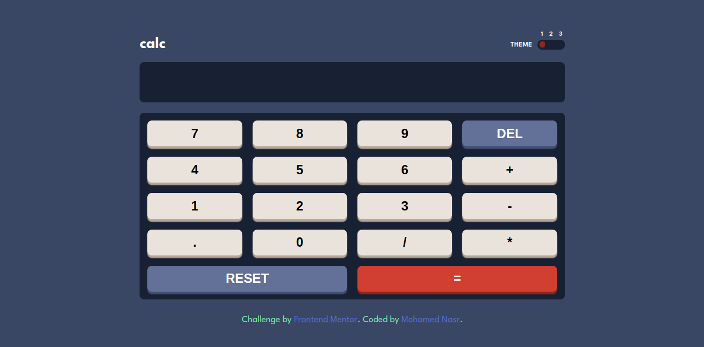
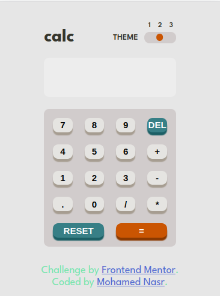

# Frontend Mentor - Calculator app solution

This is a solution to the [Calculator app challenge on Frontend Mentor](https://www.frontendmentor.io/challenges/calculator-app-9lteq5N29). Frontend Mentor challenges help you improve your coding skills by building realistic projects. 

## Table of contents

- [Overview](#overview)
  - [The challenge](#the-challenge)
  - [Screenshot](#screenshot)
  - [Links](#links)
- [My process](#my-process)
  - [Built with](#built-with)
  - [What I learned](#what-i-learned)
  - [Continued development](#continued-development)
  - [Useful resources](#useful-resources)
- [Author](#author)
- [Acknowledgments](#acknowledgments)

## Overview

### The challenge

Users should be able to:

- See the size of the elements adjust based on their device's screen size
- Perform mathmatical operations like addition, subtraction, multiplication, and division
- Adjust the color theme based on their preference
- **Bonus**: Have their initial theme preference checked using `prefers-color-scheme` and have any additional changes saved in the browser

### Screenshot

### Links

- Solution URL: [Add solution URL here](https://github.com/monasr1997/calculator-app-main)
- Live Site URL: [Add live site URL here](https://eloquent-genie-92877d.netlify.app/)

## My process

### Built with

- Semantic HTML5 markup
- CSS custom properties
- Flexbox
- CSS Grid
- Mobile-first workflow
- Java Script

### What I learned

### Continued development

### Useful resources

- [MDN web Docs](https://developer.mozilla.org/en-US/)

## Author

- Website - [Mohamed Nasr](https://linkedin.com/in/monasr1997)
- Frontend Mentor - [@monasr1997](https://www.frontendmentor.io/profile/monasr1997)
- Twitter - [@monasr1997](https://www.twitter.com/monasr1997)

## Acknowledgments

